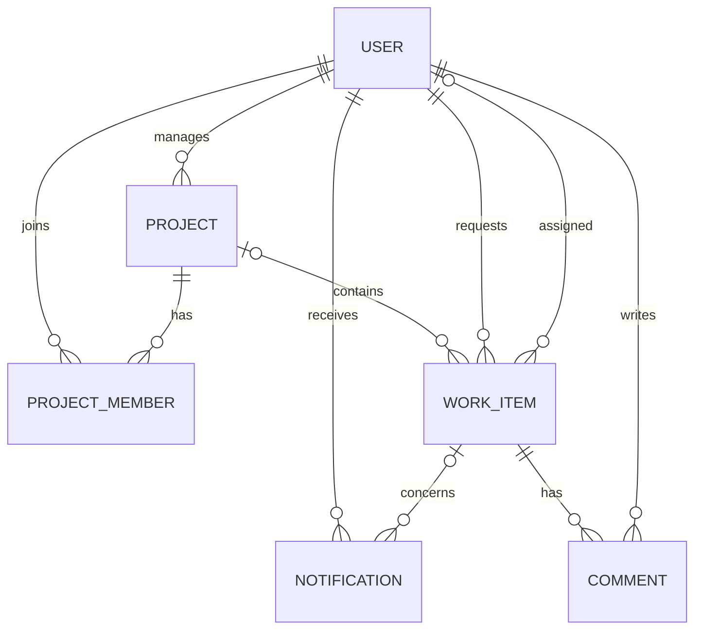

# Design decisions

## Architecture

React, Vite and Tailwind provide the interface; Express 5, Prisma 7 and PostgreSQL implement the API. Socket.IO shares the HTTP server. Development mounts Vite middleware; production serves the compiled frontend. All REST paths use `/api`, leaving client routes available for the SPA fallback.

Feature modules follow `route -> controller -> service -> repository`. Routes assemble middleware, controllers read validated input, services enforce permissions and business rules, and repositories perform database operations. Database infrastructure provides shared transaction and readiness helpers. `createApp()` does not listen, allowing Supertest to test the API without starting the application or scheduled jobs.

## Relational model



One `WorkItem` table represents both TASK and TICKET. PostgreSQL CHECK constraints require a project for tasks and restrict statuses by type. Membership has a composite primary key, preventing duplicates. UUIDs identify resources; authorization is still required regardless of identifier format.

Foreign keys restrict deleting users/projects that own work, null deleted assignees, and cascade dependent memberships, comments and notifications. Work item deletion is Admin-only. Indexes support project/status, assignee/status, requester, priority/type, due-date and creation-time queries. Notification indexes support user/read-state/time lists. A stable `id` tie-breaker accompanies list ordering; matching scoped data/count queries run in a transaction.

## Authorization

JWT verifies identity using a pinned HS256 algorithm. Every protected request reloads the user from PostgreSQL, so deleted users and role changes take effect on the next request. Passwords use bcrypt and hashes never enter API responses. Public registration uses a strict schema and always creates MEMBER accounts.

`authorize` supplies reusable role gates. Project/work-item scope functions add permissions to database filters, including list counts and search. Services decide resource-level capabilities: FULL, STATUS_ONLY or NONE. An out-of-scope resource returns 404; a visible resource with a prohibited action returns 403. Assignees with status-only capability receive `FORBIDDEN_FIELD` for other fields. Immutable work-item fields and unknown body fields are rejected by Zod.

| Operation          | Admin                                     | Manager                                        | Member                           |
| ------------------ | ----------------------------------------- | ---------------------------------------------- | -------------------------------- |
| Projects           | All; choose manager                       | Create/manage own                              | Read joined                      |
| Project membership | Manage any                                | Manage own                                     | Read joined                      |
| Work item read     | All                                       | Own projects, assigned/raised                  | Joined projects, assigned/raised |
| Task creation      | Any project                               | Own project                                    | Forbidden                        |
| Ticket creation    | Allowed                                   | Accessible project or no project               | Accessible project or no project |
| Work item edit     | Full                                      | Own project; status-only if assigned elsewhere | Assigned status-only             |
| Ticket escalation  | Allowed                                   | When permitted to edit                         | Forbidden                        |
| Work item delete   | Allowed                                   | Forbidden                                      | Forbidden                        |
| Comment creation   | Allowed                                   | Project manager/requester/assignee             | Requester/assignee               |
| User directory     | All                                       | MEMBER accounts only                           | Forbidden                        |
| Roles              | Change others, subject to ownership rules | Forbidden                                      | Forbidden                        |
| Notifications      | Own; explicit all-user list               | Own                                            | Own                              |

Project tasks are assigned only to MEMBER users belonging to the project. Project tickets can also be assigned to its manager. Project-less tickets can only be assigned by Admin, to an Admin or Manager. A member with unfinished assigned work cannot be removed. A manager owning projects cannot be demoted; Admin cannot change their own role.

Backend-computed `permissions` and `allowedTransitions` guide the UI. Hiding actions is a convenience; API checks remain authoritative. Status transitions use an explicit map and optimistic concurrency: competing changes from the same state produce one success and one `STALE_STATE` response.

## Notifications and jobs

```text
service -> transaction (write change + notification rows) -> commit -> socket publish
```

Assignment, status, comments, ticket creation and due dates produce persistent notifications. Recipients are deduplicated and the actor is excluded. Project-less ticket creation notifies Admins. Publishing happens after commit, so rolled-back changes produce no live notification. Disconnected users retrieve stored rows and unread counts after login.

Authenticated sockets join private `user:<id>` rooms and close when their JWT expires. Events carry notification/count updates to all the recipient's tabs. Sockets provide delivery; writes go through REST authorization. Socket tests connect distinct users and verify that one user's events do not reach the other.

The due-date job atomically claims eligible rows with PostgreSQL locking and inserts reminders in the same transaction. `remindedAt` prevents repeated or concurrent runs from duplicating reminders; changing the due date clears it. Overdue unfinished items are eligible too. Cleanup removes old read notifications while preserving unread ones. Jobs are disabled in tests and explicitly invoked for deterministic checks.

## Deployment and verification

Docker uses separate dependency, build, tools and runtime stages. Migration/seed tools stay out of the non-root runtime image. The pnpm readPackage hook removes optional Prisma CLI and TypeScript peers from the client package; these tools remain explicit development dependencies for generation and migrations. Compose waits for database readiness and successful migrations before starting the application; seeding is opt-in and uses development mode because production seeding is rejected. The health endpoint checks PostgreSQL. Volumes persist data; graceful shutdown closes sockets, jobs and database connections.

Vitest integration files run serially on a dedicated database whose name ends in `_test`. Setup and cleanup both check the target before destructive operations. Factories replace seed dependence. Unit tests cover policies, recipients, pagination, JWT/passwords, transitions and the database guard. CI also type-checks, lints, builds and verifies the Docker image.

## Assumptions and trade-offs

- JWTs are stored in localStorage for the assignment's simple login flow. An XSS vulnerability could expose them; a future version can use short-lived tokens with rotating httpOnly refresh cookies.
- Tasks and tickets have distinct initial statuses (TODO and OPEN), and CLOSED tickets are final. Members update assigned status only.
- Hard deletion keeps the assignment small; a production audit trail should add soft deletion or an event log.
- Search uses case-insensitive database matching and a 400 ms UI debounce. Larger datasets may need trigram indexes or full-text search.
- In-process cron keeps deployment simple; a durable job queue would add retries and monitoring. Reminder claiming already handles overlapping runs.
- Scaling Socket.IO across application instances requires a shared adapter such as Redis. Socket authentication is checked at connection time; HTTP permission changes apply immediately to subsequent API requests.
- HTTPS terminates at Caddy in the optional hosting profile. Backups, domain configuration and production credentials belong to deployment operations.
