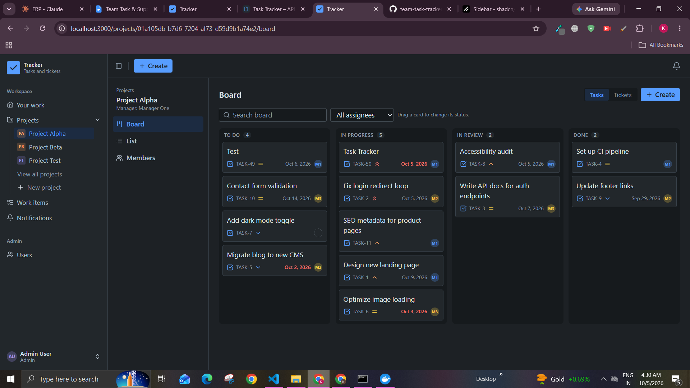
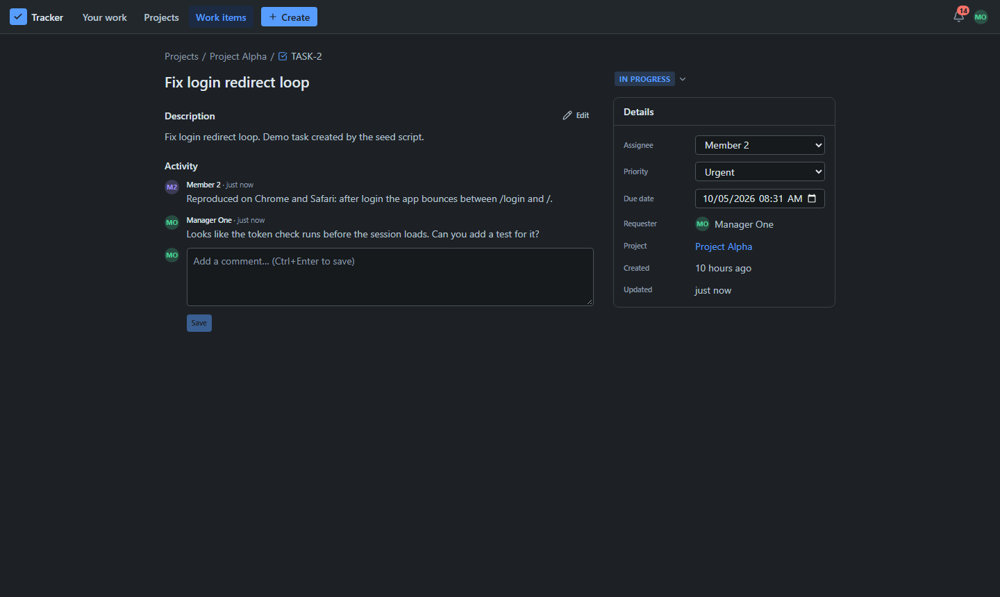

# 🎫 Unified Team Task & Support Ticket Tracker

[](https://github.com/kumudwaykole/team-task-tracker/actions/workflows/ci.yml)

One system for project tasks and support tickets, with role-based access control and real-time
notifications. React frontend (`apps/web`) and Node.js backend (`apps/server`) in one pnpm
monorepo.

## 🚀 Quick start

> [!IMPORTANT]
> You need **Git**, **Node.js 20.19 or newer**, **pnpm 10** and **Docker Desktop (running)**.
> No pnpm yet? Run `npm install -g pnpm` (or `corepack enable`).

### Option 1: Run locally (recommended)

**1. Clone the repository**

```sh
git clone https://github.com/kumudwaykole/team-task-tracker.git
cd team-task-tracker
```

**2. Install the dependencies** (one command installs both apps)

```sh
pnpm install
```

**3. Environment files.** Step 2 already created `apps/server/.env` and `.env` from the
examples, each with a new random `JWT_SECRET`, so there is nothing to do. To create them by hand
instead:

```sh
cp apps/server/.env.example apps/server/.env
cp .env.example .env
# then set JWT_SECRET in both files to 32+ random characters

```

**4. Run the application**

```sh
pnpm dev
```

This starts PostgreSQL in Docker, applies the migrations, loads the demo data on the first run,
and starts the API, Socket.IO and the React app with hot reload. Open
**http://localhost:3000** and log in with a [demo account](#-demo-accounts).

### Option 2: Run everything in Docker

Only Docker is needed (no Node.js or pnpm).

```sh
git clone https://github.com/kumudwaykole/team-task-tracker.git
cd team-task-tracker
cp .env.example .env              # PowerShell: Copy-Item .env.example .env
openssl rand -hex 32              # paste the output into JWT_SECRET in .env
# PowerShell instead: -join ((1..32) | % { '{0:x2}' -f (Get-Random -Max 256) })
docker compose --profile app up --build
```

Open **http://localhost:3000**. Compose starts PostgreSQL, applies the migrations, loads the demo
data (`SEED=true` in `.env.example`) and starts the production build. Stop it with `Ctrl+C`, or
`docker compose --profile app down` (your data is kept).

## 🔑 Demo accounts

Password for all of them: **`Password@123`**

| Role    | Email                                           |
| ------- | ----------------------------------------------- |
| Admin   | admin@tracker.dev                               |
| Manager | manager1@tracker.dev, manager2@tracker.dev      |
| Member  | member1@tracker.dev through member5@tracker.dev |

The demo data has two projects (Alpha, managed by Manager One, and Beta, managed by Manager Two)
with members, 20 tasks and 15 tickets, five of them without a project. Some items are overdue and
some are due within 24 hours. To see real-time notifications, log in as Manager One and Member
One in two browser windows (one normal, one private) and assign a task to Member One.

## ⌨️ Commands

Run them from the repository root.

| Command                              | What it does                                                        |
| ------------------------------------ | ------------------------------------------------------------------- |
| `pnpm install`                       | Install both apps, create missing `.env` files, generate Prisma     |
| `pnpm dev`                           | Start Postgres, migrate, seed an empty database, run the app (3000) |
| `pnpm build` then `pnpm start`       | Production build of both apps, then serve it                        |
| `pnpm test`                          | Unit and integration tests (Postgres must be running: `pnpm db:up`) |
| `pnpm typecheck`, `pnpm lint`        | Type checks and lint for both apps                                  |
| `pnpm db:up`, `pnpm db:down`         | Start or stop only the PostgreSQL container                         |
| `pnpm --filter server db:deploy`     | Apply database migrations                                           |
| `pnpm --filter server db:seed`       | Load the demo data (skips anything that already exists)             |
| `pnpm --filter server db:migrate`    | Create a new migration after changing `prisma/schema.prisma`        |
| `pnpm --filter server db:studio`     | Browse the database                                                 |
| `pnpm docker:up`, `pnpm docker:down` | Full stack in Docker: start, or stop and keep the data              |
| `pnpm docker:seed`                   | Load the demo data into the Docker database                         |
| `pnpm docker:reset`                  | Stop Docker and **delete the database volume**                      |

The app uses port **3000** (API, Socket.IO and UI on one port) and PostgreSQL uses port **5434**
on this machine only.

## ✨ Features

- JWT authentication, bcrypt password hashing, three roles: Admin, Manager, Member
- Permissions enforced on the server: reusable middleware plus scope rules inside every query,
  so nothing leaks through direct API calls; the UI shows only what the API allows
- Projects with members, tasks and support tickets in one work-item model, defined status
  workflows, comments
- Notifications that are stored and pushed live (Socket.IO, one private room per user),
  including due-date reminders from a scheduled job
- Best UI: drag-and-drop board, server-side pagination, debounced search

<p>
  
  
  
  
  
  
  
  
  
  
</p>

## ⚙️ Environment variables

`pnpm dev` reads `apps/server/.env` (example: `apps/server/.env.example`). Docker Compose reads
the root `.env` (example: `.env.example`). Real `.env` files are never committed.

| Variable                    | Required | Default               | Description                                                             |
| --------------------------- | -------- | --------------------- | ----------------------------------------------------------------------- |
| DATABASE_URL                | yes      |                       | Postgres connection string (local Docker: port 5434)                    |
| JWT_SECRET                  | yes      |                       | At least 32 random characters; the placeholder is refused in production |
| JWT_EXPIRES_IN              | no       | 1d                    | Token lifetime, e.g. 15m, 12h, 1d                                       |
| BCRYPT_ROUNDS               | no       | 12                    | Password hash cost, 10 to 14 in production (tests use 4)                |
| PORT                        | no       | 3000                  | HTTP port for the API, sockets and UI                                   |
| NODE_ENV                    | no       | development           | `production` serves the built UI                                        |
| CLIENT_URL                  | no       | http://localhost:3000 | Allowed origins, comma-separated                                        |
| TRUST_PROXY                 | no       | 0                     | Proxy hops in front of the app (1 behind Caddy)                         |
| RUN_JOBS                    | no       | true                  | Run the scheduled jobs                                                  |
| DUE_SOON_CRON               | no       | `*/15 * * * *`        | Reminder schedule                                                       |
| DUE_SOON_WINDOW_HOURS       | no       | 24                    | Remind when an item is due within this many hours                       |
| NOTIFICATION_RETENTION_DAYS | no       | 90                    | Read notifications older than this are deleted nightly                  |
| WEB_DIR, WEB_DIST_DIR       | no       | ../web, ../web/dist   | Frontend source (dev) and build (production), relative to apps/server   |

Docker only (root `.env`): `POSTGRES_USER`, `POSTGRES_PASSWORD`, `POSTGRES_DB`, `APP_PORT`
(3000), `DB_PORT` (5434), `SEED`, `DOMAIN`.

## 🗄 Database setup, migrations and seed

- **Setup:** PostgreSQL 16 runs in Docker (`docker-compose.yml`, service `db`). `pnpm dev` and
  `pnpm db:up` start it; the data lives in a Docker volume, so it survives restarts.
- **Migrations:** the SQL migrations in `apps/server/prisma/migrations` (including the CHECK
  constraints) are applied by `pnpm --filter server db:deploy`. `pnpm dev` and the Docker stack
  apply new ones automatically on every start.
- **Seed:** `pnpm --filter server db:seed` loads the demo users and sample data. It is safe to run
  again (it skips what already exists) and refuses to run when `NODE_ENV=production`. `pnpm dev`
  seeds only an empty database.
- **Reset:** `pnpm docker:reset` deletes the database volume; the next start recreates it.

## 🧪 Tests

```sh
pnpm db:up
pnpm test
pnpm --filter server test:coverage      # report in apps/server/coverage/
```

The integration tests use their own database, `tracker_test`, which they create and migrate on
the first run. They refuse to run against any database whose name does not end in `_test` and
build their own data, so the seed is not needed. They cover authentication and token tampering, a
table-driven permission matrix (one row per rule), every status transition, assignment rules,
concurrent updates, notification recipients, socket authentication and room isolation, and
reminder-job idempotency. CI runs type checks, lint, the tests, the build and a Docker image
check on every push.

## 📚 API

All endpoints are under `/api` (the assignment's paths plus the prefix), on port 3000.

- **API documentation:** [Google Doc](https://docs.google.com/document/d/1oXw8k8UAnjMOcnIKqv906pJDcYQJunNE3jjhCw2dLgA/edit?usp=sharing)
  every endpoint, filters, request and response examples, status transitions, error codes and
  socket events.
- **Postman:** import [the collection](docs/postman/tracker.postman_collection.json) and
  [the local environment](docs/postman/local.postman_environment.json), select the environment
  and run the collection with the Collection Runner. **8 Demo Flow** walks through the
  assignment's flow; **9 Security** contains requests that must be refused. Every request has
  assertions and a saved example response.

## 🧠 Design decisions

[Design decisions (Google Doc)](https://docs.google.com/document/d/1DFpmaXsDdYDZg75kDl7bKOBs23U1_hhBnOW-EIGB5us/edit?usp=sharing)
(also in [DESIGN.md](DESIGN.md)): database and model design, the RBAC approach, the notification
architecture, and the assumptions and trade-offs.



## 🧱 Project structure

```text
apps/
  server/              Express API, Socket.IO, jobs (TypeScript)
    prisma/            schema, SQL migrations, idempotent seed
    src/modules/       one folder per feature: routes -> controller -> service -> repository
    src/middleware/    authenticate, authorize, validate, rate limits, errors
    src/sockets/       authenticated Socket.IO, per-user rooms
    src/jobs/          due-date reminders, notification cleanup
    tests/             integration tests (guarded test database) and unit tests
  web/                 React app (Vite, Tailwind)
    src/pages/         one component per route
    src/components/    UI kit, board, work items, notifications
    src/api/           typed API client
docs/                  Postman collection, screenshots
scripts/               postinstall hook: .env files and Prisma client after pnpm install
Dockerfile             multi-stage build, non-root runtime image
docker-compose.yml     db (dev), migrate + app (--profile app), caddy (--profile prod)
```

## 🩺 Troubleshooting

| Symptom                                        | Fix                                                                                |
| ---------------------------------------------- | ---------------------------------------------------------------------------------- |
| `pnpm dev` fails at `docker compose`           | Start Docker Desktop and wait until it is running, then retry                      |
| `port is already allocated` (5434 or 3000)     | Set `DB_PORT` / `APP_PORT` in `.env`; for local dev also update `DATABASE_URL`     |
| App exits with "Invalid environment variables" | Copy the `.env.example` files; `JWT_SECRET` needs 32+ characters                   |
| Docker `migrate` exits with "Set JWT_SECRET"   | Put a generated secret in the root `.env` (see Option 2)                           |
| Tests say "Cannot reach Postgres"              | Run `pnpm db:up`, and check for a `DATABASE_URL` set in your shell                 |
| `Cannot find module ... generated/prisma`      | Run `pnpm install` again (or `pnpm --filter server db:generate`)                   |
| Blank page after `pnpm start`                  | Run `pnpm build` first (the UI is served from `apps/web/dist`)                     |
| 429 after several failed logins                | 10 failed logins per 15 minutes per IP; wait, or restart the server in development |
| Data gone after `pnpm docker:reset`            | `reset` deletes the volume; use `pnpm docker:down` to keep data                    |
