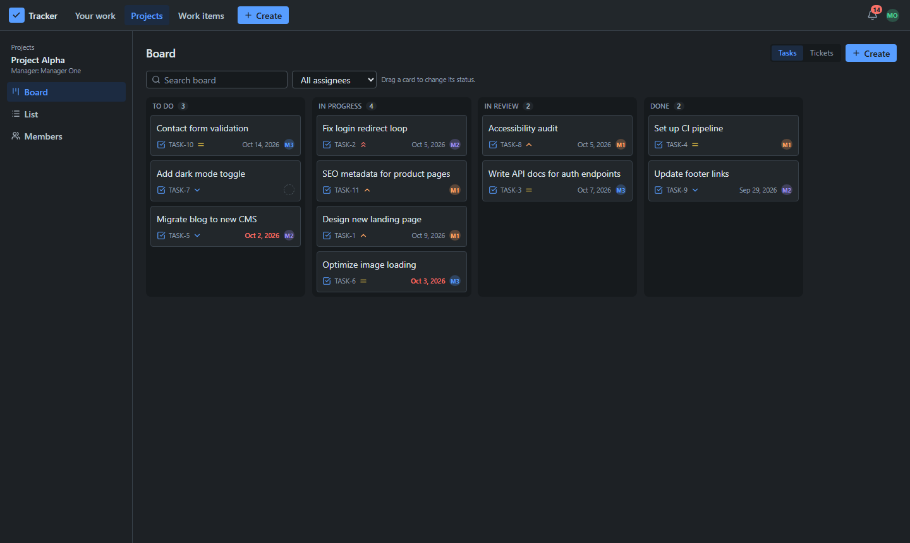

# 🎫 Unified Team Task & Support Ticket Tracker

[](https://github.com/kumudwaykole/team-task-tracker/actions/workflows/ci.yml)

One system for project tasks and support tickets, with role-based access control and real-time
notifications.

<p>
  
  
  
  
  
  
  
  
  
  
</p>



## ✨ Features

- JWT authentication, bcrypt password hashing, three roles: Admin, Manager, Member
- Permissions enforced on the server: reusable middleware plus scope rules inside every query, so
  nothing leaks through direct API calls
- Projects with members, tasks and support tickets in one work-item model, defined status
  workflows, comments
- Notifications that are stored and pushed live (Socket.IO, one private room per user), including
  due-date reminders from a scheduled job
- Jira-style dark UI: drag-and-drop board, server-side pagination, debounced search

## 🚀 Quick start (Docker, one command)

Needs Docker with Compose v2.

```sh
cp .env.example .env          # PowerShell: Copy-Item .env.example .env
node -e "console.log(require('crypto').randomBytes(48).toString('hex'))"
# paste the printed value into JWT_SECRET in .env
docker compose --profile app up --build
```

Open http://localhost:3000 and log in with a [demo account](#-demo-accounts). Compose starts
PostgreSQL, applies the migrations, loads the demo data (`SEED=true` in `.env.example`) and
starts the production build.

## 🛠 Local development

Needs Node 20.19 or newer, pnpm 10.34.4 (`corepack enable` picks it up), and Docker for PostgreSQL.

```sh
pnpm bootstrap   # install, create .env files, generate Prisma, start Postgres, migrate, seed
pnpm dev         # API + Socket.IO + React with hot reload, all on http://localhost:3000
```

`pnpm bootstrap` (also `pnpm run setup`; plain `pnpm setup` is a pnpm built-in) can be run
again safely: it keeps existing `.env` files and the seed skips data that already exists.

The API lives under `/api` and the React app is served by the same Express server, so there is
one port, no CORS setup and no second dev server. In development Vite runs inside Express; in
production Express serves the built files. For a local production build: `pnpm build`, then
`pnpm start`.

## 🔑 Demo accounts

Password for all of them: `Password@123`.

| Role    | Email                                           |
| ------- | ----------------------------------------------- |
| Admin   | admin@tracker.dev                               |
| Manager | manager1@tracker.dev, manager2@tracker.dev      |
| Member  | member1@tracker.dev through member5@tracker.dev |

The seed creates two projects (Alpha for Manager One, Beta for Manager Two) with members, 20
tasks and 15 tickets, five of them without a project. Some items are overdue and some are due
within 24 hours, so reminders and the overdue filter have data to show.

## ⚙️ Environment variables

`pnpm dev` and the tests read `apps/server/.env` (example: `apps/server/.env.example`). Docker
Compose reads the root `.env` (example: `.env.example`). Never commit real `.env` files.

| Variable                    | Required | Default               | Description                                                           |
| --------------------------- | -------- | --------------------- | --------------------------------------------------------------------- |
| DATABASE_URL                | yes      |                       | Postgres connection string (local Docker: port 5434)                  |
| JWT_SECRET                  | yes      |                       | At least 32 random characters; placeholder refused in production      |
| JWT_EXPIRES_IN              | no       | 1d                    | Token lifetime, e.g. 15m, 12h, 1d                                     |
| BCRYPT_ROUNDS               | no       | 12                    | Hash cost, 10 to 14 in production (tests use 4)                       |
| PORT                        | no       | 3000                  | HTTP port for the API, sockets and UI                                 |
| NODE_ENV                    | no       | development           | `production` serves the built UI                                      |
| CLIENT_URL                  | no       | http://localhost:3000 | Allowed origins, comma-separated                                      |
| TRUST_PROXY                 | no       | 0                     | Proxy hops in front of the app (1 behind Caddy)                       |
| RUN_JOBS                    | no       | true                  | Run the scheduled jobs                                                |
| DUE_SOON_CRON               | no       | `*/15 * * * *`        | Reminder schedule                                                     |
| DUE_SOON_WINDOW_HOURS       | no       | 24                    | Remind when an item is due within this many hours                     |
| NOTIFICATION_RETENTION_DAYS | no       | 90                    | Read notifications older than this are deleted nightly                |
| WEB_DIR, WEB_DIST_DIR       | no       | ../web, ../web/dist   | Frontend source (dev) and build (production), relative to apps/server |

Docker-only (root `.env`): `POSTGRES_USER`, `POSTGRES_PASSWORD`, `POSTGRES_DB`, `APP_PORT`
(3000), `DB_PORT` (5434), `SEED`, `DOMAIN`.

## 🗄 Database

```sh
pnpm db:up                         # start only PostgreSQL (Docker, port 5434)
pnpm --filter server db:deploy     # apply migrations
pnpm --filter server db:seed       # load the demo data (refused when NODE_ENV=production)
pnpm --filter server db:migrate    # create a new migration after a schema change
pnpm --filter server db:studio     # browse the data
```

In Docker, migrations run automatically on every `up`, before the app starts. `pnpm docker:seed`
seeds the Docker database, `pnpm docker:down` stops everything and keeps the data, and
`pnpm docker:reset` **deletes the database volume**.

## 🧪 Tests

```sh
pnpm db:up
pnpm test                               # unit and integration tests
pnpm --filter server test:coverage      # report in apps/server/coverage/
```

The integration tests use their own database, `tracker_test`, which they create and migrate on
the first run. They refuse to run against any database whose name does not end in `_test`, and
build their own data, so the seed is not needed. Settings come from `apps/server/.env.test`;
variables already set in the shell or CI win.

They cover authentication and token tampering, a table-driven permission matrix (one row per
rule, about 100 rows), every status transition, assignment rules, concurrent updates,
notification recipients, socket authentication and room isolation, and reminder-job idempotency.
CI runs type checks, lint, the tests, the build and a Docker image check on every push.

## 📚 API

All endpoints are under `/api` (the assignment's paths plus the prefix).

- Endpoint reference, filters, error codes and socket events: [docs/API.md](docs/API.md)
- Postman: import [the collection](docs/postman/tracker.postman_collection.json) and
  [the local environment](docs/postman/local.postman_environment.json), select the environment
  and run the whole collection with the Collection Runner. **8 Demo Flow** walks through the
  assignment's expected flow; **9 Security** contains requests that must be refused. Every
  request has assertions and a saved example response.

Postman cannot show live socket events. To see them, log in as Manager One and Member One in two
browsers (or one normal and one private window) and assign a task to Member One: their bell and a
toast update without a refresh. `apps/server/tests/socket.test.ts` checks the same thing.

## 🧱 Project structure

```text
apps/
  server/              Express API, Socket.IO, jobs (TypeScript)
    prisma/            schema, SQL migrations, idempotent seed
    src/modules/       one folder per feature: routes -> controller -> service -> repository
    src/middleware/    authenticate, authorize, validate, rate limits, errors
    src/sockets/       authenticated Socket.IO, per-user rooms
    src/jobs/          due-date reminders, notification cleanup
    tests/             integration tests (guarded test database) and unit tests
  web/                 React app (Vite, Tailwind)
    src/pages/         one component per route
    src/components/    UI kit, board, work items, notifications
    src/api/           typed API client
docs/                  API reference, Postman collection, hosting notes, screenshots
scripts/bootstrap.mjs  first-time local setup
Dockerfile             multi-stage build, non-root runtime image
docker-compose.yml     db (dev), migrate + app (--profile app), caddy (--profile prod)
```

## 🧠 Design decisions

See [DESIGN.md](DESIGN.md) for the data model, permission rules, notification architecture and
trade-offs, [docs/TRACEABILITY.md](docs/TRACEABILITY.md) for where each requirement is
implemented and tested, and [docs/HOSTING.md](docs/HOSTING.md) for running it on a server with
HTTPS.


## 🩺 Troubleshooting

| Symptom                                        | Fix                                                                                               |
| ---------------------------------------------- | ------------------------------------------------------------------------------------------------- |
| `port is already allocated` (5434 or 3000)     | Set `DB_PORT` / `APP_PORT` in `.env`; for local dev also update `DATABASE_URL`                    |
| App exits with "Invalid environment variables" | Copy the `.env.example` files; `JWT_SECRET` needs 32+ characters and no placeholder in production |
| `migrate` exits with "Set JWT_SECRET"          | Generate a secret (see Quick start) and put it in the root `.env`                                 |
| Tests say "Cannot reach Postgres"              | `pnpm db:up`, and check for a `DATABASE_URL` set in your shell                                    |
| `Cannot find module ... generated/prisma`      | `pnpm --filter server db:generate`                                                                |
| Blank page in production, API works            | Run `pnpm build` first (the UI is served from `apps/web/dist`)                                    |
| Live updates fail behind a proxy               | The proxy must pass WebSocket upgrades (the included Caddy does)                                  |
| Everyone shares one rate limit behind a proxy  | Set `TRUST_PROXY=1`                                                                               |
| 429 after several failed logins                | 10 failed logins per 15 minutes per IP; wait, or restart the server in development                |
| Data gone after `pnpm docker:reset`            | `reset` deletes the volume; use `pnpm docker:down` to keep data                                   |
